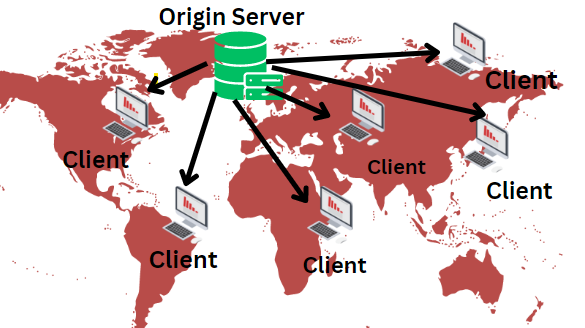
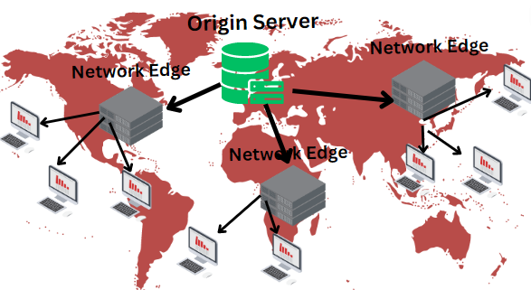

## *React is a JavaScript library which is being built by Facebook Engineers. React helps us to create Single-Page applications in Frontend Development.*
<br>

## ***What is the difference between Library and Framework?***
### *Suppose we are working in JavaScript where we have Array specific Higher Order Methods such as Map, Filter & Reduce and we use them in our code to manipulate the given array. But we don't have to worry that how this Map method is working behind the scenes or we haven't written the code for this Map method by ourselves we are just using this method which means that the code for this Map method is written somewhere, Right? So we can consider it like a standard Library of JS where these predefined functions and methods are available. But we can also have many other libraries as well*
<br>

**Library** : ***Suppose in a Web Application we have to create an Image Carousel. Either we can write the entire code from scratch for this Carousel or we can use a JS library called "Swiper" which have the prewritten code and just by calling some of its function we can implement the Carousel in our application very easily. Similarly to make Single-Page Applications we have React.***

***So a Library is a piece of code which we can be use in our application. It takes minimum effors to use a Library in our code i.e. most of the time just by using a CDN link. Library provide us more control as compared to Framework Which means that we decides that where we have to call those given Library specific functions and where not. But Library alone can't built a full application. It needs several supports , for e.g. React does not have its own Router so we have to install it seperately. But when it comes to freedom Library provides us too much freedom. It just like staying in a Home where you have to follow less rules.***

**Framework** : *** Framework is not just a piece of code but it is a Software which we have to install in our system. Framework have full support for building a full-fledged application but you have to follow Framework specific rules. So unlike Library Freedom is very less in while working with Frameworks. Also the Inversion of Control is not in our hand it is the Framework which decides when and where to use our code/functions. So Framework is like a School 😃 where we get full support for our exams but we have to follow their rules.In Frameworks a proper Design Pattern and Architecture is available. So some ceratin sections are fixed where we have to write Business Logic, Designing and HTML Templates etc. Frameworks can Manage issues of Security, Maintanability, Sacalability and Migration very easily ***


<hr>
<br>

## ***What is CDN?***
### CDN stands for Content Delivery Network. A CDN is a geographically distributed group of servers which delivers fast internet content. Suppose we hosted our web application on a server and suppose this server is in USA. But our clients are all over the world and we know that whenver client request anything from the server the request has to travel from client's IP address to server's IP address and same amount of time will be taken when server sends the response to client. In such cases a client sitting in Canada can access resources from our web application faster as compared to a client sitting in India. To resolve this issue we have CDNs. 
### CDN does not host the content so we still need the hosting server. But what CDN does it cached the content in all of its different servers. These different servers of CDN are know as Network Edge. So for the first when a request hits for our web application it will go to origin servers but after this all static files such media, js, css will be cached in the Network Edges. Also the Network Edge which will take minimum time and bandwidth to serve these files. Dynamic files are not cached but the optimum route is taken to get them fast by CDN. 

### Advantages of CDN : - Improving web site load time, consuming less bandwidth, improving web site availability and improving security of the web application, it's cost is very low as compared to Hosting Servers.

<br>
<br>

## Content without a CDN
### Content is served from the original location. This uses more processing power and bandwidth, taking longer to reach the user and resulting in increased load and an inferior user experience

<br>


<br>
<br>
<br>
## Content with a CDN
### Content is mainly served from the closest CDN server (Network Edge). Delivery from the cache server reduces load on your origin servers and provides content to the user faster, resulting in a superior user experience.
<br>
<br>



<br>
<br>
<hr>


## What is Emmet?

### Emmet is a plug in for many popular text editors which greatly improves HTML & CSS workflow. you can use short expressions to generate HTML, Markup, CSS. You can use ctrl + space to see the workflow of the code that will be generated(Inside a pop up)

<br>
<br>
<hr>

## Why React is known as "React"?

## React is a Front-End JavaScript library. React is eveloped by Facebook Engineers. React is based on the concept of reusable components i.e. whenever I am performing any action suppose I am clicking on button then not the entire web page should reload but only that data which is needed should change and other component remains the same. This provides a fast, smooth and responsive user experience. It is meant to help developers build user interfaces that are fast and responsive, or “reactive.” The library was designed to “react” to changes in data.

<br>
<br>
<hr>

## What is diference between React and ReactDOM?
### When we build our React application we import two libraries one is React and other is ReactDOM. React is the core library. It caontains APIs like `React.createElement()`, `React.component` & `React.children`. Which means that this core library React helps us to build React components. On the other ReactDOM is the web browser specific library of React. ReactDOM is a binding link between React and DOM. Normally we use ReactDOM to render our React component into Web Page using `React.renderElement()`.

<br>
<br>


### The reason why React and ReactDOM is seperated into two CDN links because React is not only limited to Web Browsers. There is something called React Native which is a React framework for building Mobile applications. There is also React 3D and they are depended on the core library React. That's why we have React & ReactDOM seperate CDN links.

<br>
<br>
<hr>

## What is difference between react.development.js and react.production.js files via CDN?
### react.development.js
```javascript
<script crossorigin src="https://unpkg.com/react@18/umd/react.development.js"></script>
<script crossorigin src="https://unpkg.com/react-dom@18/umd/react-dom.development.js"></script>
```

### These are called developemnet files of React & ReactDOM. These are files designed for actual developement, in which we have organised code with indentation, comments & easily readable format & variable & functions name. These files are developed only for development purpose. Due to these comments & indentation, The size of these files grow and there is no point in hosting these files in our web server. Because since their size is more they will eventually effect the load time & bandwidth of our server.

 ### react.production.js
### So once we want to deploye our appllication. We have production files of React that must be used.
```javascript
<script crossorigin src="https://unpkg.com/react@18/umd/react.production.min.js"></script>
<script crossorigin src="https://unpkg.com/react-dom@18/umd/react-dom.production.min.js"></script>
```

### In these files we have compressed, minfied and optimized code which have removed comments and extra speces. So size of the files reduces.

<br>
<br>
<hr>

## What is the difference between async & defer attribute that we use in script tag?

We have three ways by which we can fetch and execute scripts on our web page.

1. Normal Script Tag

2. Script Tag with the async attribute

3. Script Tag with defer attribute

When a web page is being loaded two operations take place

1. HTML Parsing

2. Fetching & Execution of Scripts
<br>
<br>

### **Normal Script Tag**
When a Web Browser starts to load a Web Page, it will first start to Parse the HTML but once it encounters a script tag the Parsing of HTML stops and the Fetching of Scripts starts, once Fetching is done the Execution of these Scripts will take place and when both Fetching & Execution of scripts finished then only remaining HTML Parsing will again start. So normal script tags stop parsing of HTML until scripts are not fetched and executed.
<br>
<br>


